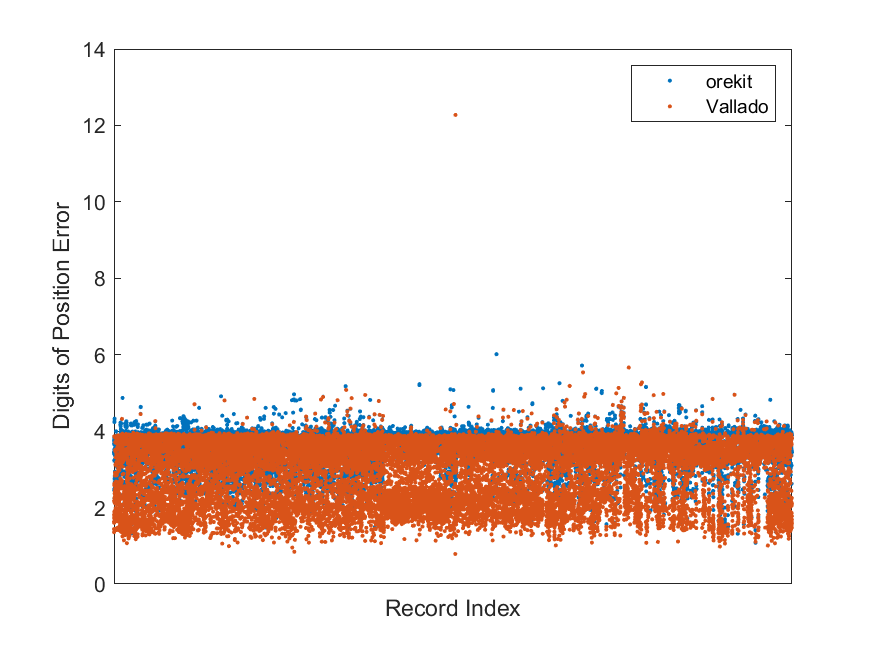

# sgp4-comparison
Compare implementations of sgp4.

## Catalogue
I am using the JSON version of the space-track catalogue, using the following steps (see [space-track](https://www.space-track.org/documentation#howto-api_curl))
```
$ curl -c cookies.txt -b cookies.txt https://www.space-track.org/ajaxauth/login -d 'identity=myusername&password=mY_S3cr3t_pA55w0rd!'
$ curl --cookie cookies.txt https://www.space-track.org/basicspacedata/query/class/gp/EPOCH/%3Enow-30/orderby/NORAD_CAT_ID,EPOCH/format/json > catalogue.json
```

## Output
The code that wraps each implementation
* reads the JSON catalogue file, then
* outputs a binary data file containing the propagated position and velocity for each object.

The binary data files have the form
* Number of objects - uint32
* Number of time-points per object - uint32
* For each object
  * NORAD ID - uint32
  * Time-point data (seconds since epoch, x, y, z, xv, yv, yz) - 7 double-precision floating point

## Comparison
The resulting data files are loaded and compared with a Matlab script.

Using the AFSPC (space-track) output as the reference values, the position error of the orekit and Vallado implementations is calculated.  This first figure tries to capture the relative error, by calculating the number of (decimal) digits that are different in the two positions.  We can see that all three implementations agree very closely, mostly being within 3-4 least significant digits different.



There is one interesting outlier, which appears in both the orekit and Vallado SGP4 code.  Vallado has an "AFSPC" and and an "improved" flag in his code and this different appears only in his improved version, which means that it's more likely to be an inconsistency in the AFSPC code than in orekit or Vallado.

This second figure is the absolute position error (in metres) plotted against the semi-major axis for each of the objects.  Again, all three implementations are very similar, with errors increasing with SMA as expected because of limited numerical precision.


